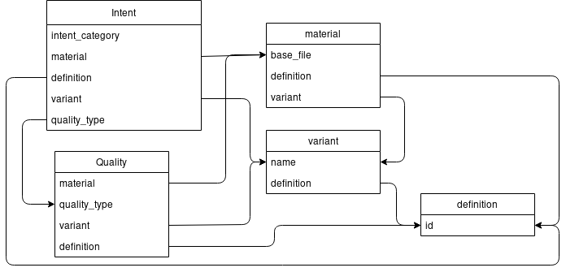

# Profils & Paramètres
[Document d'origine](https://github.com/Ultimaker/Cura/wiki/Profiles-&-Settings)

Cura utilise un système de profils superposés. Un aperçu schématique de ce système est présenté dans l'image ci-dessous.

## Paramètres

Chacune des entrées de la pile (par exemple, Utilisateur, Qualité, Matière, etc.) décrit un profil. Lorsque nous voulons savoir quel pourcentage de remplissage doit être utilisé ("infill_sparse_density"), nous demandons simplement à la pile de l'extrudeuse quelle est sa valeur. La pile de l'extrudeuse demandera ensuite à chacun des profils qui la caractérise (en séquence) s'ils ont une valeur pour le paramètre demandé. Le premier profil à donner une réponse définira le résultat.

Une situation un peu plus compliquée se produit lorsque la valeur d'un paramètre est définie par une fonction. Prenons l'exemple suivant. Nous avons un paramètre "support_xy_distance" (Distance des supports en X/Y par rapport au modèle)  dont la valeur est définie par la formule "=wall_line_width_0 * 2". Cette valeur est définie dans le profil de qualité de l'extrudeuse. La valeur de "wall_line_width_0" est définie dans la configuration de l'imprimante uniquement et est fixée à 0.4 (il est lui même égal à 	
=wall_line_width).

Lorsque nous demandons la valeur de "support_xy_distance", nous nous attendons à obtenir 0.8 en conséquence. Les appels suivants seront effectués dans l'ordre :

>extruder_stack.getProperty("support_xy_distance", "value") -> Returns 0.8

>user.getProperty("support_xy_distance", "value") -> Returns None

>quality_changes.getProperty("support_xy_distance", "value") -> Returns None

>intent.getProperty("support_xy_distance", "value") -> Returns None

>quality.getProperty("support_xy_distance", "value") -> Returns "=wall_line_width_0 * 2"

>user.getProperty("wall_line_width_0", "value") -> returns None

>quality_changes.getProperty("wall_line_width_0", "value") -> Returns None

>intent.getProperty("wall_line_width_0", "value") -> Returns None

>quality.getProperty("wall_line_width_0", "value") -> Returns None

>material.getProperty("wall_line_width_0", "value") -> Returns None

>machine.getProperty("wall_line_width_0", "value") -> Returns "=wall_line_width"

>machine.getProperty("wall_line_width", "value") -> Returns 0.4

## Profiles

Les profils ont une certaine interdépendance les uns avec les autres, comme on peut le voir sur la photo ci-dessous. 

### Utilisateur (User)

Les paramètres de l'utilisateur sont tous les changements qui ne sont pas enregistrés dans un profil. Dans l'interface, une icône circulaire de réinitialisation est affichée pour chacun de ces paramètres. Ils sont totalement indépendants de la qualité, des changements de qualité ou de l'intention. Ils sont uniquement "liés" à une machine.

### Changements de qualité (Quality Changes)

Les modifications de qualité contiennent les paramètres que l'utilisateur a modifiés et enregistrés dans un profil. Ainsi, un profil unique généré par un utilisateur contient au moins 2 fichiers (un **quality_change** pour l'extrudeuse et un pour la pile globale). Les modifications de qualité sont uniquement liées au type_qualité, puisqu'elles décrivent un "delta" à appliquer sur une qualité. Ainsi, même si une qualité change parce qu'un matériau change, le profil des modifications de qualité peut rester le même (puisqu'il n'y a qu'un lien, le **quality_type** reste le même)

### Objectif (Intent)

Les profils d'intention contiennent des paramètres qui modifient la qualité en leur donnant une intention (par exemple : "Engineering" ou "Smooth"). Ces profils dépendent de l'article, de la variante et du type_qualité

### Qualité (Quality)

Les profils de qualité conservent la résolution de l'impression en réglant la hauteur des couches. Comme toutes les extrudeuses doivent avoir la même hauteur de couche, cette valeur est fixée dans la partie global_stack de la qualité.

### Matière (Material)

Conservez tous les paramètres définis par la matière active.

### Variante (Variant)

La variante, dans le cas de l'extrudeuse, contient des réglages qui ont trait à la taille de la buse ou des réglages spécifiques qui s'y rapportent.

### Définition changes (Definition changes)

Si un utilisateur apporte des modifications à une machine, mais pas au point de la considérer comme un type de machine entièrement nouveau, les réglages sont enregistrés ici.

### Définition (Definition)

Les paramètres par défaut de la machine.
